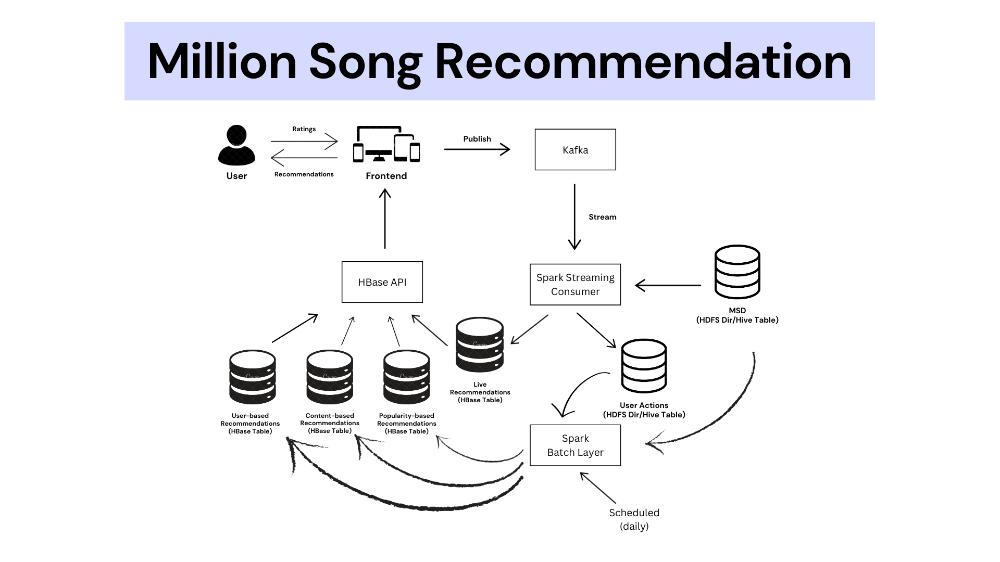

# Million Song Recommendation

This project is a music recommendation system designed to generate and deliver personalized song recommendations using 
the lambda architecture with both batch and real-time processing. The architecture incorporates the Million Song Dataset
(MSD), live user actions, and scalable tools like Spark, Kafka, and HBase to create an efficient recommendation 
pipeline.

Further details can be found in the README.md files within each of the project directories.

## Design

Key components:

1. Batch Layer
   - Uses the static MSD dataset and dynamic user interactions to generate three types of recommendations:
     - Content-Based Recommendations: Based on feature similarity.
     - User-Based Recommendations: Generated using the ALS algorithm.
     - Popularity-Based Recommendations: Built on song and artist hotness metrics.
   - Data flows through Spark jobs, Hive, and HBase for frontend access.

2. Speed Layer
   - Processes live user activity data streamed from Kafka using Spark Streaming.
   - Generates real-time recommendations using feature similarity.
   - Outputs recommendations to the HBase table for immediate use.

3. Frontend
   - Aggregates recommendations from batch and speed layers, presenting them in a shuffled manner.
   - Captures user interactions (e.g., ratings, skips) and publishes them to Kafka for further processing.

4. Data Lake
    - The Hive tables msd and user_actions form the data lake for this application, where each data point is persisted
    as an unaltered value, and can be used to rebuild any components or fix data discrepancy issues in case of errors. 

5. Data Flow and Integration
   - Kafka serves as the backbone for real-time data streaming.
   - Spark processes both batch and streaming workloads.
   - Hive and HBase manage intermediate and final datasets, with Hive allowing for managing the data stored on HDFS as
   parquet, and HBase acting as the serving layer for the application, accessed via the API.

## Technology Considerations

1.	Kafka enables high-throughput, low-latency, and scalable streaming of real-time user activity data from the frontend
to the backend layers (speed and batch). Its durability and partitioning capabilities make it ideal for managing event 
streams like user interactions.
2.	Spark’s unified engine supports both batch and streaming processing, making it a perfect fit for this project’s 
requirements. Spark Streaming processes real-time data for the speed layer, while its batch processing capabilities 
handle the heavy computations for generating recommendations in the batch layer.
3.	HBase is a scalable, NoSQL database optimized for low-latency read and write operations. It is well-suited for 
storing and retrieving recommendation data quickly, enabling the frontend to deliver a responsive user experience.
4.	Hive simplifies the management of large-scale structured data and supports easy querying using SQL-like syntax. It 
serves as an intermediary layer for data transfer between Spark and HBase, streamlining the storage and processing 
pipeline.
5.	Parquet is an efficient, columnar storage format optimized for analytical workloads. Its compression and encoding 
capabilities minimize storage usage while enabling faster data retrieval, making it ideal for the high-volume datasets 
used in this project.
7.	HDFS is a distributed, fault-tolerant file system designed for big data workloads. It provides the storage backbone 
for both the static MSD dataset and intermediate datasets generated during batch processing.
8.	Node.js is used for the frontend due to its event-driven, non-blocking I/O model, which makes it lightweight and 
highly efficient for handling real-time updates like displaying recommendations and user interactions.

By leveraging these technologies, the system achieves scalability, efficiency, and responsiveness across both real-time 
and batch processing workflows.

## Future Enhancements

- Introduce user account support to persist preferences, interaction history, and personalized settings.
- Implementing smarter integration of batch and speed layer recommendations.
- Enhancing popularity metrics using positive user interactions within specific timeframes.
- Streamlining data ingestion to write directly from Spark to HBase.

## References

- Million Song Dataset (http://millionsongdataset.com/)
- Bronzini Marco and Lazzerini Giacomo (2020), The Million Song Dataset (MSD): ETL, data exploration and Gaussian 
Mixture clustering in Databricks Community (https://github.com/saturnMars/bigDataTechnologies)
- Spark, Hive, HBase, Node, and Kafka Documentations