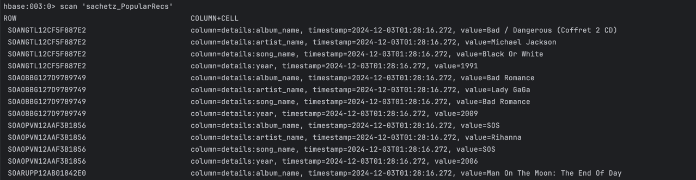
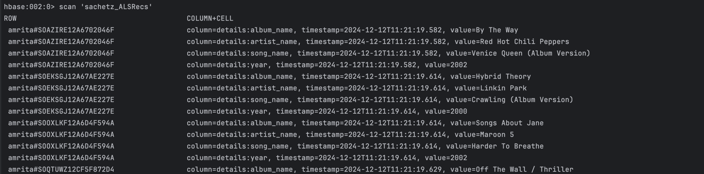
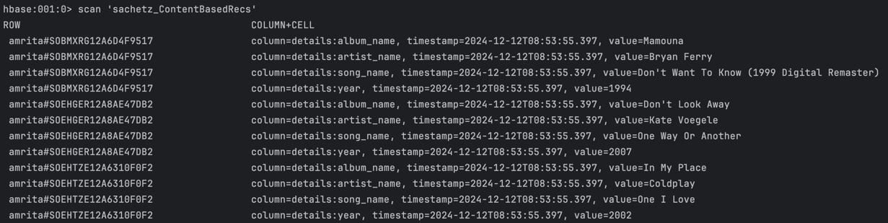

# Batch Layer

The batch layer generates three types of recommendations by leveraging the static MSD dataset and the dynamic user 
actions dataset:
1.	Content-Based Recommendations - Built using the similarity between the average feature vector of songs liked by the 
user.
2.	User-Based Recommendations - Generated using the ALS algorithm to recommend songs based on actions of users with 
similar music preferences.
3.	Popularity-Based Recommendations - Common across all users and currently implemented as the songs with the highest 
song_hottness and artist_hottness metrics due to limited user actions.

Each recommendation type is generated through separate Spark jobs, scheduled to run daily. The resulting data is written
to Hive, and then transferred to HBase using HQL scripts, enabling frontend access.

## Screenshots

Popularity based recommendations:

User Similarity based Recommendations:

Content Similarity based Recommendations:

## Future Work

1.	Improving Popularity-Based Recommendations 

In real-world scenarios, popularity-based recommendations should be implemented as songs with the most positive user 
interactions within a specific timeframe, instead of relying on static metrics like song_hottness and artist_hottness.

2. Streamlining Data Ingestion

The current two-step ingestion process (Spark → Hive → HBase) is necessitated by configuration limitations between Spark
and HBase. A direct ingestion pipeline from Spark to HBase should be established to reduce processing overhead and 
improve efficiency.

3. Aggregation for the user actions table

Currently, the speed layer writes directly to the user actions table, leading to the creation of numerous small files 
per batch. Ideally, the speed layer should write to an intermediate table or storage (not necessarily in Parquet 
format). The batch layer would then process and coalesce this intermediate data into the user actions table for 
long-term persistence, ensuring better data organization and reducing the overhead caused by small file generation.

## Steps to Run

Execute the commands available in the script `scripts/execute_batch.sh`