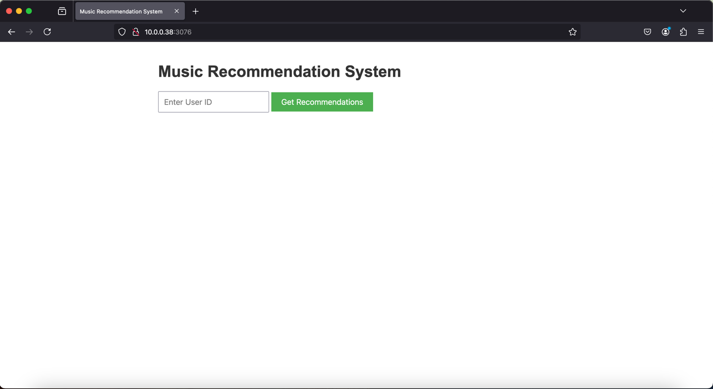
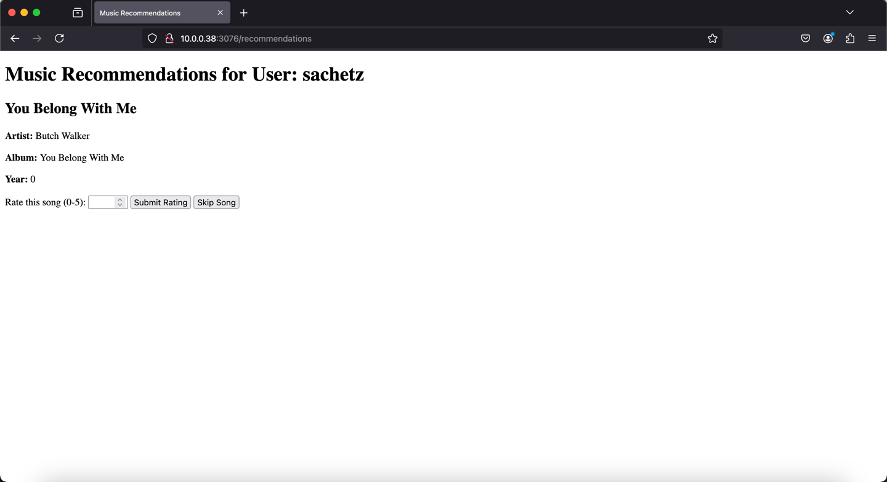
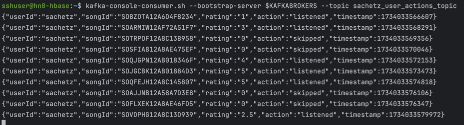
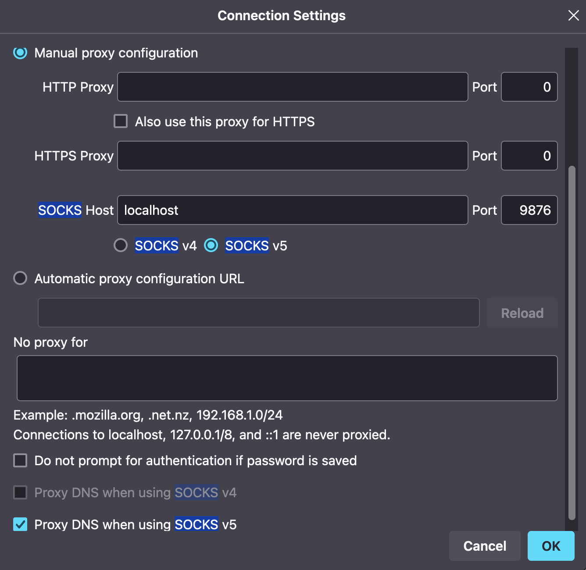

# Frontend

The frontend retrieves recommendations from four HBase tables via the API:
- sachetz_PopularRecs,
- sachetz_ContentBasedRecs,
- sachetz_ALSRecs (all populated via the batch layer),
- sachetz_OngoingRecs (populated via the speed layer).

The recommendations from these tables are aggregated and presented to the user in a shuffled manner. Users can either 
skip a song—logged as “skipped” and excluded from future recommendation generation—or rate the song on a scale of 0 to 5
(in 0.5 increments).

All interactions, including user ID, song ID, rating, action type (listened or skipped), and timestamp, are published to
a Kafka topic for further processing.

## Screenshots

User login:

Recommendations:

Publishing to Kafka:

## Future Work

Simply aggregating and shuffling recommendations may not yield the best user experience. An enhanced approach would 
involve:
- Batch and Speed Layer Integration: Loading batch-layer recommendations on user startup and refreshing speed-layer 
- recommendations dynamically during the session.
- Probability-Based Selection: Selecting songs from the four recommendation types based on a tailored probability 
- distribution.
- User-Driven Choice: Allowing users to select the type of recommendations they want to listen to, adding a layer of 
- personalization and control.

These improvements aim to create a more dynamic and user-centered recommendation experience.

## Kafka Consumer Monitoring

To monitor the Kafka topic

> kafka-console-consumer.sh --bootstrap-server $KAFKABROKERS --topic sachetz_user_actions_topic

## Steps to use

1. Go to the project directory and run:
> npm install

> node app.js $KAFKABROKERS 3076

2. Configure proxy settings (in Firefox):

3. Execute on your local machine:
> ssh -i \<ssh private key> -C2qTnNf -D 9876 sshuser@hbase-mpcs53014-2024-ssh.azurehdinsight.net

4. Access:
> http://10.0.0.38:3076/
