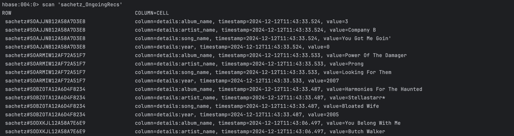

# Speed Layer

The application’s speed layer is designed to deliver real-time recommendations based on live user activity.

This layer is implemented as a Spark Streaming application, which consumes user activity data published by the frontend 
to Kafka. The ingested data is written to the user_actions table, forming an integral part of the application’s data 
lake and supporting further recommendation generation in the batch layer.

Additionally, the speed layer processes this user action data to produce real-time recommendations using feature 
similarity. These recommendations are then stored in the HBase table sachetz_OngoingRecs for immediate use.

## Screenshots

Live Recommendations:

## Future Work

The current implementation simplifies recommendation generation by focusing on a subset of the MSD dataset. However, the
complete dataset is significantly larger, and building recommendations based on feature similarity at scale presents 
challenges, such as increased computational complexity and potential latency issues. Future work will explore 
optimization techniques, such as dimensionality reduction, sampling strategies, or approximate nearest neighbor 
algorithms, to efficiently handle the entire dataset while maintaining the responsiveness of live recommendations.

## Steps to Run

Execute the command available in the script `scripts/start_app.sh`